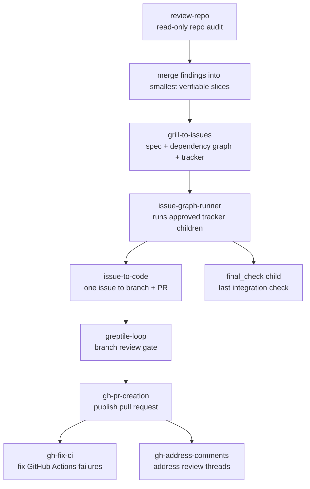
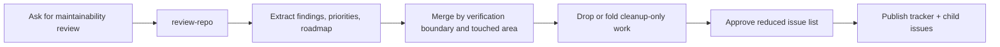
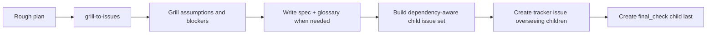
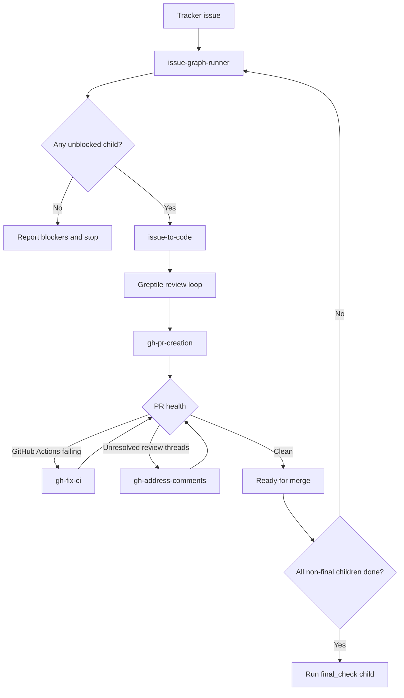
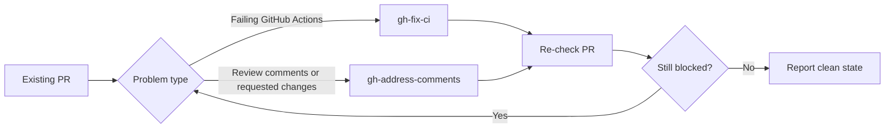

# Skills

Repository of custom skills.

| Name | Description | Install | Last updated (UTC) |
|---|---|---|---|
| `agent-aeo` | Implements agent-oriented website access patterns, including discovery metadata, markdown page views, llms.txt, and Accept negotiation. | `npx skills install HenryQW/skills agent-aeo -a codex -y` | 2026-05-10 12:32 |
| `agent-memory` | Sets up project-scoped agent memory and distills `.context/progress.md` into markdown Agent memory. | `npx skills install HenryQW/skills agent-memory -a codex -y` | 2026-07-01 20:11 |
| `gh-address-comments` | Addresses actionable GitHub PR review feedback using thread-aware review reads and focused local fixes. | `npx skills install HenryQW/skills gh-address-comments -a codex -y` | 2026-07-03 10:25 |
| `gh-fix-ci` | Debugs failing GitHub Actions PR checks with `gh`, log inspection, root-cause summaries, and approved focused fixes. | `npx skills install HenryQW/skills gh-fix-ci -a codex -y` | 2026-07-03 10:25 |
| `gh-pr-creation` | Creates or publishes GitHub or GitLab pull requests from the current branch with diff inspection, Conventional Commit titles, explicit push handling, and a fixed PR body template. | `npx skills install HenryQW/skills gh-pr-creation -a codex -y` | 2026-07-02 16:45 |
| `greptile-loop` | Runs compact Greptile review loops on the current branch and fixes actionable findings. | `npx skills install HenryQW/skills greptile-loop -a codex -y` | 2026-07-03 01:44 |
| `grill-to-issues` | Turns approved `$grill-with-docs` specs into dependency-aware GitHub child issues plus an implementation tracker issue and exactly one `final_check` child. | `npx skills install HenryQW/skills grill-to-issues -a codex -y` | 2026-07-01 20:45 |
| `issue-graph-runner` | Executes dependency-aware tracker child issues through `issue-to-code`, then routes PR CI and review cleanup to the right skills. | `npx skills install HenryQW/skills issue-graph-runner -a codex -y` | 2026-07-03 10:18 |
| `issue-to-code` | Implements a GitHub issue into a clean feature branch, runs Greptile review loops, commits, and hands off to `gh-pr-creation` after a clean pass. | `npx skills install HenryQW/skills issue-to-code -a codex -y` | 2026-07-03 01:44 |
| `review-repo` | Reviews a repository for evidence-backed maintainability, DRY, SOLID, testing, and architecture improvements without editing code. | `npx skills install HenryQW/skills review-repo -a codex -y` | 2026-07-02 17:51 |
| `triangulate` | Runs structured multi-agent evaluation workflows that generate, challenge, and adjudicate evidence-backed findings. | `npx skills install HenryQW/skills triangulate -a codex -y` | 2026-04-03 12:40 |

## How the Skills Fit Together

These skills form a small harness stack:

- Planning skills turn ambiguous work into issue graphs.
- Execution skills implement one issue at a time.
- PR hygiene skills clean up CI failures and review comments.
- Support skills provide memory, audits, website agent access, or structured evaluation.

## Skill Roles

| Skill | Human-readable role | Usually feeds into |
|---|---|---|
| `review-repo` | Finds maintainability problems with evidence, without editing files or tracker state. | A human-approved issue plan or `grill-to-issues` style issue graph. |
| `grill-to-issues` | Converts a rough plan into a grilled spec, dependency-aware child issues, one tracker issue, and one final check issue. | `issue-graph-runner`. |
| `issue-graph-runner` | Orchestrates an existing tracker issue: pick unblocked children, run implementation, then route PR cleanup. | `issue-to-code`, `gh-fix-ci`, `gh-address-comments`. |
| `issue-to-code` | Implements exactly one issue on a clean branch, runs Greptile review loops, commits, and opens a PR. | `gh-pr-creation`, then PR hygiene skills. |
| `greptile-loop` | Reviews the current branch with Greptile and fixes actionable branch-diff findings before PR publication. | `issue-to-code` or manual branch cleanup. |
| `gh-pr-creation` | Publishes a reviewed local branch as a PR with the repository's expected title/body style. | `gh-fix-ci` and `gh-address-comments` if the PR is not clean. |
| `gh-fix-ci` | Inspects failing GitHub Actions checks, identifies root cause, applies focused fixes, and pushes updates after approval. | Back to PR verification. |
| `gh-address-comments` | Reads unresolved PR review threads, fixes actionable comments, and replies or resolves only when explicitly requested. | Back to PR verification. |
| `agent-memory` | Maintains durable project memory and distills progress notes into future-use context. | Any long-running project workflow. |
| `agent-aeo` | Adds or audits public website affordances for AI crawlers and markdown-friendly access. | Website implementation or review work. |
| `triangulate` | Uses multiple review perspectives to consolidate evidence-backed conclusions. | Planning, review, and decision points. |

## Typical Harness Workflows

### Maintainability Review to Tracker

Use this when the starting point is "audit this repo" and the output should become implementable tracker work.

First principles for the merge step:

- Same verification boundary means one issue.
- Same touched area usually means one issue.
- Cleanup with no independent value folds into nearby work or gets dropped.
- Structural risk stays separate.
- Every issue must be independently verifiable.

### Grilled Spec to Issue Graph

Use this when the starting point is a rough plan that needs hard questioning before implementation.

### Tracker Graph to Pull Requests

Use this after a tracker issue exists and implementation should proceed one child issue at a time.

Default execution rule: do not stack PRs. Start each child from the base branch unless the tracker explicitly says otherwise, and run `final_check` only after all other children are merged or verified complete.

### PR Cleanup Loop

Use this when a PR already exists and needs to become mergeable.

