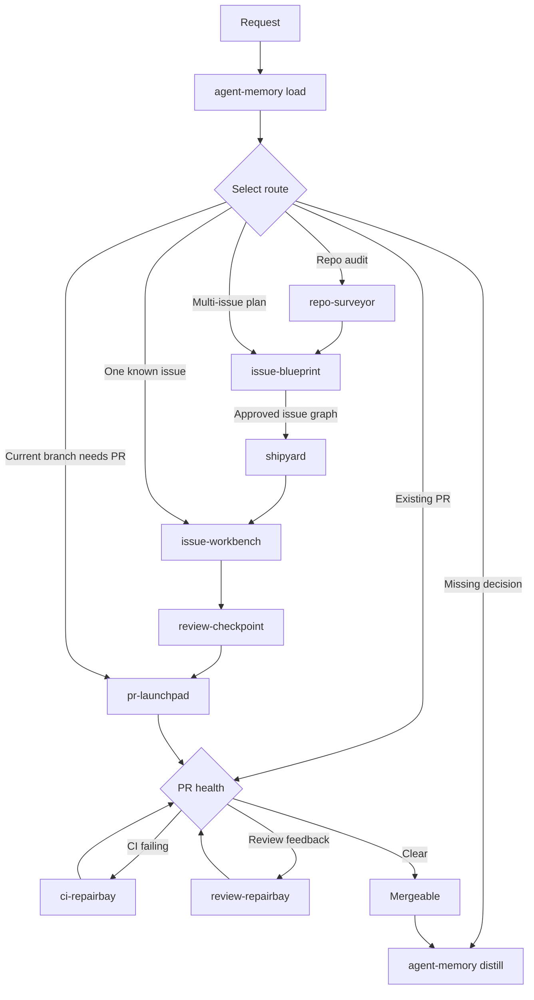

# Skills

🚢 Automated engineering workflows for Codex.

Give an agent a plan, issue, branch, or pull request. These skills can carry it through analysis, implementation, checks, review, and publication while stopping for decisions and approvals that need a human.

## 📦 Installation

Install every skill for Codex:

```bash
npx skills add HenryQW/skills
```

## ✨ Why use them

- Automate complete workflows instead of isolated coding steps.
- Keep changes scoped with branches, worktrees, checks, and review gates.
- Preserve evidence so later steps can reuse valid results instead of repeating work.

## ⚙️ Requirements

- GitHub workflows require authenticated `gh`.
- `greptile` is optional; `review-checkpoint` falls back to adversarial review when unavailable.

## 🧭 Choose a workflow



Start with the smallest route that fits:

- One actionable issue: `issue-workbench #<issue>`
- A repository audit: `repo-surveyor`, then `issue-blueprint` if you want issues created
- A multi-issue feature: `issue-blueprint`, then `shipyard #<parent>`
- A branch ready to publish: `pr-launchpad`
- A pull request blocked by checks or review: `ci-repairbay` or `review-repairbay`

## 🤖 What each skill automates

### 🚀 Workflow skills

#### [`ci-repairbay`](ci-repairbay/)

Takes a failing GitHub Actions check from log inspection to a verified fix. Inspection is read-only; when asked to fix, it changes only the affected code and reruns the relevant checks.

#### [`issue-blueprint`](issue-blueprint/)

Turns a rough multi-issue plan into an approved GitHub issue graph. It sharpens the scope, links every acceptance criterion to a concrete check, maps dependencies, and creates the issues after approval.

#### [`issue-workbench`](issue-workbench/)

Takes one GitHub issue through implementation, checks, and blocker review in an isolated branch. It then opens a pull request or returns a structured handoff to `shipyard`.

#### [`pr-launchpad`](pr-launchpad/)

Takes a finished branch to a published pull request. It inspects the diff, validates the current commit, commits pending work, pushes the branch, and creates a consistent PR title and description.

#### [`repo-surveyor`](repo-surveyor/)

Scans a repository for maintainability risks and returns ranked findings with file-level evidence. It is read-only and does not modify code.

#### [`review-checkpoint`](review-checkpoint/)

Runs a blocker-only code review using Greptile or an independent fallback reviewer. It records the result for the exact commit and only applies fixes when the workflow authorizes them.

#### [`review-repairbay`](review-repairbay/)

Takes unresolved pull request feedback through inspection, focused fixes, replies, and thread resolution. It rechecks GitHub until no actionable review threads remain.

#### [`shipyard`](shipyard/)

Takes a parent issue to one integration pull request. It runs dependency-ready child issues in parallel worktrees, merges their branches, performs final verification and review, then publishes the combined change.

### 🧰 Supporting skills

#### [`agent-aeo`](agent-aeo/)

Adds or audits the public files, routes, and headers that let AI agents read a website reliably. It covers agent discovery files, clean Markdown views, and content negotiation.

#### [`agent-memory`](agent-memory/)

Loads only the project context needed for the current task, then saves durable decisions and results for future work. Obsidian is recommended, but any folder that stores Markdown (`.md`) files can provide the memory layer; connect it with the [`agent-memory` setup guide](agent-memory/references/setup.md).

#### [`identify-optimizations`](identify-optimizations/)

Scans a repository, ranks its five best architecture improvements, and generates an HTML report with clear before-and-after diagrams. It does not run tests or edit application code.

#### [`skill-optimizer`](skill-optimizer/)

Finds wasted steps or unreliable behavior in an existing skill, applies the smallest root-cause improvement, and verifies representative use cases. It improves existing skills rather than creating new ones.

## 📄 License

Apache License 2.0.
See [LICENSE](LICENSE).
