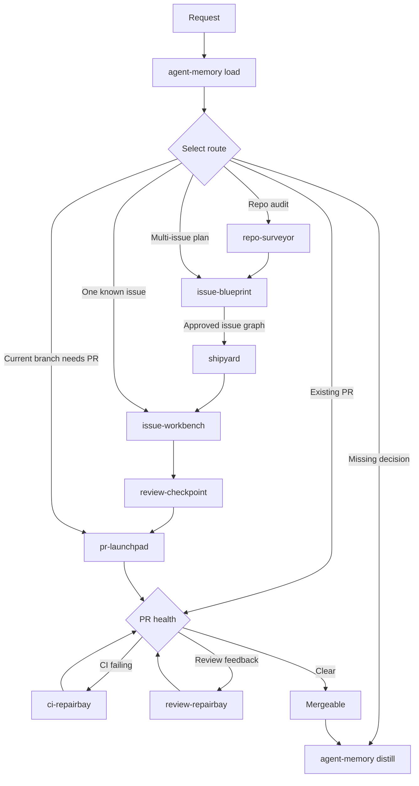

# Skills

🚢 Composable agent workflows for planning, building, reviewing, and shipping.

## Requirements

- GitHub workflows require authenticated `gh`.
- `greptile` is optional; `review-checkpoint` falls back to adversarial review when unavailable.

## 🧠 Agent Memory

For first-time setup, follow [`agent-memory` setup](agent-memory/references/setup.md).

## 🧭 Workflow Map

Use the lowest-power route that fits the request.

| Input | Route |
|---|---|
| One actionable GitHub issue | `issue-workbench #<issue>` |
| Repo audit that should become issue work | `repo-surveyor` → `issue-blueprint` |
| Rough multi-issue feature | `issue-blueprint` → `shipyard #<parent>` |
| Existing PR blocked by CI or review | `ci-repairbay` / `review-repairbay` |
| Current branch just needs a PR | `pr-launchpad` |
| Missing product decision | Stop and ask |

## 📦 Skill Reference

These tables are the canonical skill inventory: category, purpose, install command, and last implementation update.

### Workflow Skills

| Category | Name | Purpose | Install | Last updated (UTC) |
|---|---|---|---|---|
| PR cleanup | `ci-repairbay` | Diagnose and fix failing GitHub Actions PR checks. | `npx skills install HenryQW/skills ci-repairbay -a codex -y` | 2026-07-11 10:55 |
| Planning | `issue-blueprint` | Interactively refine a rough multi-issue plan, then publish its approved dependency-aware issue graph. | `npx skills install HenryQW/skills issue-blueprint -a codex -y` | 2026-07-11 21:30 |
| Execution | `issue-workbench` | Implement one issue with guarded diffs, deferred review gates, and JSON integration handoff. | `npx skills install HenryQW/skills issue-workbench -a codex -y` | 2026-07-11 22:12 |
| PR publishing | `pr-launchpad` | Publish the current branch as a GitHub or GitLab pull request. | `npx skills install HenryQW/skills pr-launchpad -a codex -y` | 2026-07-11 10:58 |
| Planning | `repo-surveyor` | Review a repo and return concise evidence-backed maintainability findings. | `npx skills install HenryQW/skills repo-surveyor -a codex -y` | 2026-07-11 10:58 |
| Review gate | `review-checkpoint` | Run read-only Greptile reviews or authorized blocker-fix loops, with adversarial review fallback. | `npx skills install HenryQW/skills review-checkpoint -a codex -y` | 2026-07-11 21:50 |
| PR cleanup | `review-repairbay` | Inspect, fix selected, or clear all actionable GitHub PR review feedback. | `npx skills install HenryQW/skills review-repairbay -a codex -y` | 2026-07-11 11:00 |
| Execution | `shipyard` | Orchestrate a parent issue through branch reconciliation, child worktrees, pending review gates, and one final PR. | `npx skills install HenryQW/skills shipyard -a codex -y` | 2026-07-11 21:50 |

### Supporting Skills

| Category | Name | Purpose | Install | Last updated (UTC) |
|---|---|---|---|---|
| Support | `agent-aeo` | Add or audit public website access patterns for AI agents. | `npx skills install HenryQW/skills agent-aeo -a codex -y` | 2026-07-11 10:54 |
| Support | `agent-memory` | Load and distill deterministic project memory; bootstrap only with `--setup`. | `npx skills install HenryQW/skills agent-memory -a codex -y` | 2026-07-11 10:55 |
| Support | `identify-optimizations` | Read-only scan for five architecture improvements with before/after diagrams. | `npx skills install HenryQW/skills identify-optimizations -a codex -y` | 2026-07-11 20:52 |
| Support | `skill-optimizer` | Optimize existing skills from evidence, apply the smallest root-cause change, and verify behavior. | `npx skills install HenryQW/skills skill-optimizer -a codex -y` | 2026-07-11 11:03 |

## 📄 License

Apache License 2.0.
See [LICENSE](LICENSE).
