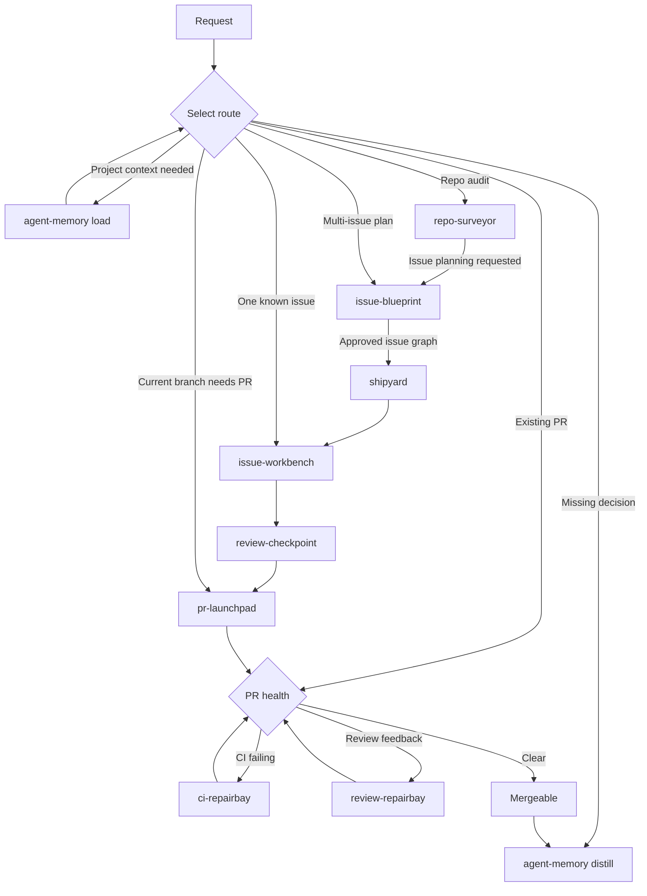

# Skills

🚢 Automated engineering workflows for Codex.

Give an agent a plan, issue, branch, or pull request. These skills can carry it through analysis, implementation, checks, review, and publication while stopping for decisions and approvals that need a human.

## 📦 Installation

Install every skill for Codex:

```bash
npx skills add HenryQW/skills --skill '*' --agent codex -y
```

## ✨ Why use them

- Automate complete workflows instead of isolated coding steps.
- Keep changes scoped with branches, worktrees, checks, and review gates.
- Preserve evidence so later steps can reuse valid results instead of repeating work.

## ⚙️ Requirements

- GitHub workflows require authenticated `gh`.
- `greptile` is optional; `review-checkpoint` falls back to adversarial review when unavailable.

## 🧭 Choose a workflow



Start with the smallest route that fits:

- One actionable issue: `issue-workbench #<issue>`
- A repository audit: `repo-surveyor`; request issue planning to hand off to `issue-blueprint`
- A multi-issue feature: `issue-blueprint`, then `shipyard #<parent>`
- A branch ready to publish: `pr-launchpad`
- A pull request blocked by checks or review: `ci-repairbay` or `review-repairbay`

## 🤖 What each skill automates

### 🚀 Workflow skills

#### [`ci-repairbay`](ci-repairbay/)

Inspects failing GitHub Actions checks, validates its inspection tooling, then makes and verifies a focused fix only when asked. Inspection remains read-only.

#### [`issue-blueprint`](issue-blueprint/)

Turns a rough multi-issue plan into an approved GitHub issue graph, owning its embedded contract, rendering, and publication behavior.

#### [`issue-workbench`](issue-workbench/)

Takes one GitHub issue through scoped implementation and blocker review, then opens a PR or supplies inspected child facts to `shipyard` for a canonical integration handoff.

#### [`pr-launchpad`](pr-launchpad/)

Publishes a finished branch: inspect the diff, validate the current commit, commit and push pending work, then create a consistent PR.

#### [`repo-surveyor`](repo-surveyor/)

Read-only DRY, SOLID, test-strategy, and architecture audit with ranked, file-level findings in an HTML report with before-and-after diagrams.

#### [`review-checkpoint`](review-checkpoint/)

Runs blocker-only review using Greptile or an independent fallback, records the exact commit result, and applies fixes only when authorized.

#### [`review-repairbay`](review-repairbay/)

Fixes exact supplied PR feedback directly, or fetches thread state when discovery, replies, or resolution are required.

#### [`shipyard`](shipyard/)

Takes an Issue Blueprint parent graph to one integration PR while owning canonical child handoffs, lifecycle state, integration checks, review, and publication.

### 🧰 Supporting skills

#### [`agent-aeo`](agent-aeo/)

Adds or audits public discovery files, Markdown routes, and headers so AI agents can read a website reliably.

#### [`agent-memory`](agent-memory/)

Loads task-relevant project context, then saves durable results through a transactional, observable write plan. Any Markdown folder can provide the memory layer; see the [`agent-memory` setup guide](agent-memory/references/setup.md).

#### [`skill-optimizer`](skill-optimizer/)

Finds waste or unreliable behavior in an existing skill, applies the smallest root-cause improvement, and verifies representative cases.

## 📄 License

Apache License 2.0.
See [LICENSE](LICENSE).
