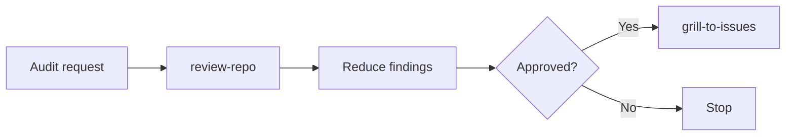
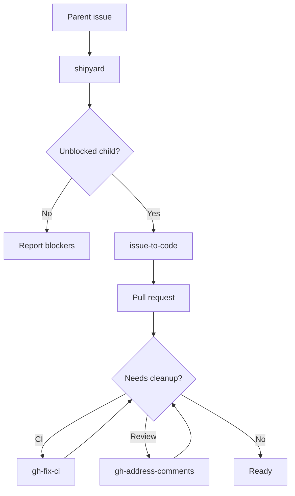
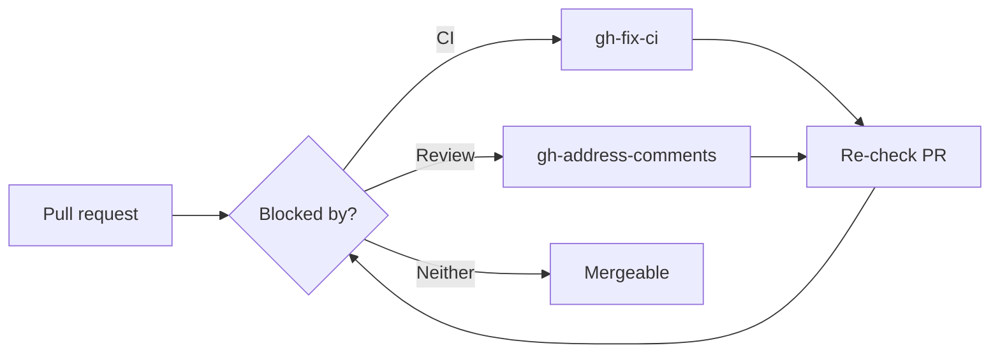

# Skills

Repository of custom skills for Codex agents.

Codex is the default agent target, but these skills may be adapted for other agents that support comparable skill instructions.

The table is the canonical skill inventory: description, install command, and last implementation update.

| Name | Description | Install | Last updated (UTC) |
|---|---|---|---|
| `agent-aeo` | Implements agent-oriented website access patterns, including discovery metadata, markdown page views, llms.txt, and Accept negotiation. | `npx skills install HenryQW/skills agent-aeo -a codex -y` | 2026-05-10 12:32 |
| `agent-memory` | Sets up project-scoped agent memory and distills `.context/progress.md` into markdown Agent memory. | `npx skills install HenryQW/skills agent-memory -a codex -y` | 2026-07-01 20:11 |
| `gh-address-comments` | Addresses actionable GitHub PR review feedback using thread-aware review reads and focused local fixes. | `npx skills install HenryQW/skills gh-address-comments -a codex -y` | 2026-07-03 10:25 |
| `gh-fix-ci` | Debugs failing GitHub Actions PR checks with `gh`, log inspection, root-cause summaries, and approved focused fixes. | `npx skills install HenryQW/skills gh-fix-ci -a codex -y` | 2026-07-03 10:25 |
| `gh-pr-creation` | Creates or publishes GitHub or GitLab pull requests from the current branch with diff inspection, Conventional Commit titles, explicit push handling, and a fixed PR body template. | `npx skills install HenryQW/skills gh-pr-creation -a codex -y` | 2026-07-02 16:45 |
| `greptile-loop` | Runs compact Greptile review loops on the current branch and fixes actionable findings. | `npx skills install HenryQW/skills greptile-loop -a codex -y` | 2026-07-03 01:44 |
| `grill-to-issues` | Turns approved `$grill-with-docs` specs into dependency-aware GitHub child issues plus one parent issue and exactly one `final_check` child. | `npx skills install HenryQW/skills grill-to-issues -a codex -y` | 2026-07-01 20:45 |
| `shipyard` | Executes dependency-aware child issues from a parent issue through `issue-to-code`, then routes PR CI and review cleanup to the right skills. | `npx skills install HenryQW/skills shipyard -a codex -y` | 2026-07-03 10:18 |
| `issue-to-code` | Implements a GitHub issue into a clean feature branch, runs Greptile review loops, commits, and hands off to `gh-pr-creation` after a clean pass. | `npx skills install HenryQW/skills issue-to-code -a codex -y` | 2026-07-03 01:44 |
| `review-repo` | Reviews a repository for evidence-backed maintainability, DRY, SOLID, testing, and architecture improvements without editing code. | `npx skills install HenryQW/skills review-repo -a codex -y` | 2026-07-02 17:51 |

## Workflows

### Audit to Issue Plan

Use this when the starting point is "audit this repo" and the output should become approved issue work.

- Run `review-repo`.
- Merge findings by touched area and verification boundary.
- Drop cleanup-only work or fold it into nearby valuable work.
- Use `grill-to-issues` only after the reduced issue list is approved.

### Plan to Issue Graph

Use this when the starting point is a rough plan that needs hard questioning before implementation.

- Run `grill-to-issues`.
- Produce the spec, dependency-aware child issues, parent issue, and one `final_check` child.

### Issue Graph to Pull Requests

Use this after a parent issue exists and implementation should proceed one child issue at a time.

- Run `shipyard`.
- Let it choose the next unblocked child and route implementation through `issue-to-code`.
- Do not stack PRs unless the parent issue explicitly requires it.
- Run `final_check` only after all other children are merged or verified complete.

### Pull Request to Mergeable

Use this when a PR already exists and needs to become mergeable.

- Use `gh-fix-ci` for failing GitHub Actions checks.
- Use `gh-address-comments` for unresolved review threads or requested changes.
- Re-check the PR after each cleanup pass.
