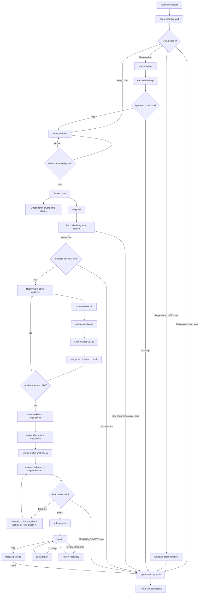
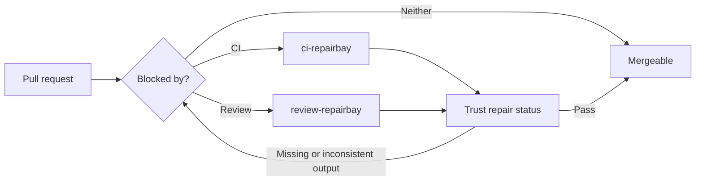

# Skills

<h1 align="center">
  🚢 Shipping ideas into production.
</h1>

A collection of skills for harness engineering and loop engineering: 🚢 shipping ideas into production.

These skills are small, composable workflow harnesses.
Each one owns one leg of the loop: survey the repo, blueprint the issues, build one issue, launch the PR, repair CI or review feedback, and let `shipyard` coordinate the route.

Supports Codex and other agents that use `npx skills` to manage skills.

## External Requirements

These workflows assume the external tools are already available:

- `gh` authenticated for the target GitHub repository.
- `greptile` is optional; `review-checkpoint` falls back to adversarial review when unavailable.

## 🧠 Agent Memory Setup

`agent-memory` includes its own Obsidian policy and bootstrap script. Export an existing vault root before launching the agent:

```bash
export OBSIDIAN_ROOT="/absolute/path/to/Obsidian/vault"
npx skills install HenryQW/skills agent-memory -a codex -y
```

Then invoke `$agent-memory --setup Project_Name`. Setup instructions are loaded only when `--setup` is present; normal memory work does not spend context on them. Setup previews the global, project, local-context, and Obsidian changes and applies them only after approval with the preview hash. It never edits shell startup files. See [`agent-memory/references/setup.md`](agent-memory/references/setup.md) for the exact commands and file effects.

## 🧭 Workflow Map



## 🔁 Workflows

### 🧭 Route Selection

Use the lowest-power workflow that can safely deliver the request.

| Input | Route |
|---|---|
| One known actionable GitHub issue | `issue-workbench #<issue>` |
| Clear multi-issue feature | `issue-blueprint` → `shipyard` |
| Unclear destination or product behavior | Stop and ask for the missing decision before creating an issue graph |
| Existing PR blocked by CI or review | `ci-repairbay` / `review-repairbay` |
| Current branch just needs a PR | `pr-launchpad` |

### 🪶 Single Issue to Pull Request

Use this when the starting point is one existing, actionable GitHub issue.

- Run `issue-workbench #<issue>` directly.
- Do not run `issue-blueprint`.
- Do not create a parent issue, child issue graph, Shipyard branch, or `final_check`.
- Keep the implementation to the issue's explicit acceptance criteria.
- `issue-workbench` still runs the review gate and hands off to `pr-launchpad`.

### 🔍 Audit to Issue Plan

Use this when the starting point is "audit this repo" and the output should become approved issue work.

- Run `repo-surveyor`.
- Merge findings by touched area and verification boundary.
- Drop cleanup-only work or fold it into nearby valuable work.
- Use `issue-blueprint` only after the reduced issue list is approved.

### 🧱 Plan to Issue Graph

Use this when the starting point is a rough multi-issue plan that needs decisions before implementation.

- Run `issue-blueprint` to draft and render the spec and provisional issue graph.
- Let it resolve factual blockers, then answer its recommended product decisions until review reports zero blockers.
- Approve the final bundle explicitly before it publishes the dependency-aware child issues, parent issue, one `final_check` child, and the `shipyard` execution block.

### 🚢 Issue Graph to Pull Requests

Use this after a parent issue exists and implementation should proceed through the deterministic integration branch.

- Run `shipyard #<parent>`.
- Switch, create, or rename to the parent-derived integration branch before execution; stop only on dirty or unreconcilable branch state.
- Initialize `.context/shipyard-manifest.json` before launching children; keep `.context/progress.md` as a pointer to it.
- Create worktrees only for the current runnable dependency wave, run each child through `issue-workbench` in integration mode, and write child handoff JSON to temp files before passing it to manifest tooling.
- Use bounded blocking review for single-child waves; reserve `wait_mode=defer` for real async or resumable coordination.
- Merge review-clean handoffs back into the shipyard branch, then re-inspect for newly unblocked children.
- Run `final_check` through `issue-workbench` only after all other children are merged or verified complete.
- Run `review-checkpoint` on the shipyard branch for final review instead of driving Greptile directly; route blocker findings back through the owning worktree or an integration fix.
- Use one PR health snapshot after `pr-launchpad`; invoke repair skills only for concrete failures or review comments.

### 🛠️ Pull Request to Mergeable

Use this when a PR already exists and needs to become mergeable.



- Use `ci-repairbay` for failing GitHub Actions checks.
- Use `review-repairbay` for unresolved review threads or requested changes.
- If the only non-green signal is a known unavailable external review check that the user or caller explicitly waived or replaced, record `Pending external unavailable check: <check>` instead of invoking repair skills.
- Trust the repair skill's reported status; re-check only when its output is missing or inconsistent.

## 📦 Skill Reference

These tables are the canonical skill inventory: category, purpose, install command, and last implementation update.

### Workflow Skills

| Category | Name | Purpose | Install | Last updated (UTC) |
|---|---|---|---|---|
| PR cleanup | `ci-repairbay` | Diagnose and fix failing GitHub Actions PR checks. | `npx skills install HenryQW/skills ci-repairbay -a codex -y` | 2026-07-10 17:10 |
| Planning | `issue-blueprint` | Interactively refine a rough multi-issue plan, then publish its approved dependency-aware issue graph. | `npx skills install HenryQW/skills issue-blueprint -a codex -y` | 2026-07-10 17:10 |
| Execution | `issue-workbench` | Implement one issue with guarded diffs, deferred review gates, and JSON integration handoff. | `npx skills install HenryQW/skills issue-workbench -a codex -y` | 2026-07-10 17:01 |
| PR publishing | `pr-launchpad` | Publish the current branch as a GitHub or GitLab pull request. | `npx skills install HenryQW/skills pr-launchpad -a codex -y` | 2026-07-10 17:01 |
| Planning | `repo-surveyor` | Audit a repo and return compact issue-ready maintainability findings. | `npx skills install HenryQW/skills repo-surveyor -a codex -y` | 2026-07-10 17:10 |
| Review gate | `review-checkpoint` | Run blocker-only Greptile review, defer pending reviews, or fallback to adversarial review. | `npx skills install HenryQW/skills review-checkpoint -a codex -y` | 2026-07-10 17:10 |
| PR cleanup | `review-repairbay` | Resolve actionable GitHub PR review feedback. | `npx skills install HenryQW/skills review-repairbay -a codex -y` | 2026-07-10 17:10 |
| Execution | `shipyard` | Orchestrate a parent issue through branch reconciliation, child worktrees, pending review gates, and one final PR. | `npx skills install HenryQW/skills shipyard -a codex -y` | 2026-07-10 17:10 |

### Supporting Skills

| Category | Name | Purpose | Install | Last updated (UTC) |
|---|---|---|---|---|
| Support | `agent-aeo` | Add or audit public website access patterns for AI agents. | `npx skills install HenryQW/skills agent-aeo -a codex -y` | 2026-07-04 06:23 |
| Support | `agent-memory` | Load and distill deterministic project memory; bootstrap only with `--setup`. | `npx skills install HenryQW/skills agent-memory -a codex -y` | 2026-07-10 17:01 |
| Support | `skill-optimizer` | Optimize existing skills from evidence, apply the smallest root-cause change, and verify behavior. | `npx skills install HenryQW/skills skill-optimizer -a codex -y` | 2026-07-10 12:04 |

## 📄 License

Apache License 2.0.
See [LICENSE](LICENSE).
