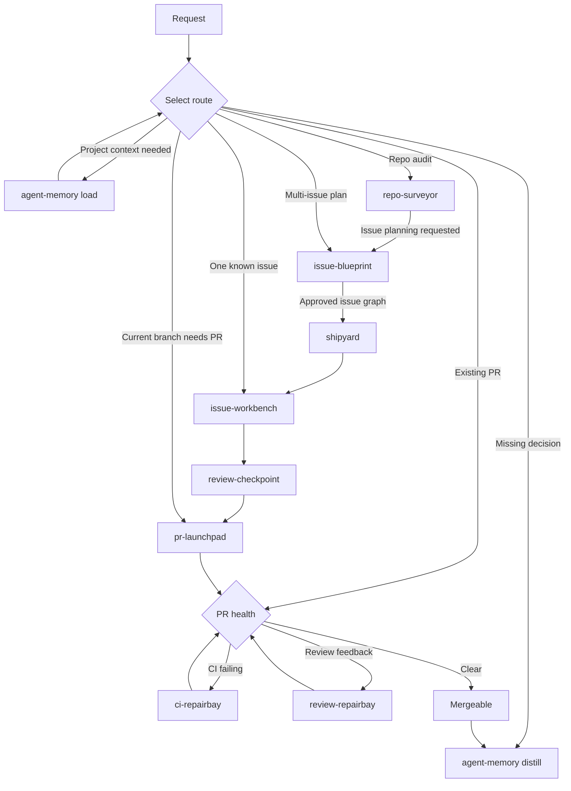

# Skills

Agent-run workflows for repository planning, implementation, review, and pull requests.

## 📦 Installation

```bash
npx skills add HenryQW/skills --skill '*' --agent codex -y
```

## ⚙️ Requirements

- GitHub workflows require authenticated `gh`.
- `greptile` is optional; `review-checkpoint` falls back to adversarial review when unavailable.

## 🧭 Choose a workflow



Start with the smallest route that fits:

- One actionable issue: `issue-workbench #<issue>`
- A repository audit: `repo-surveyor`; request issue planning to hand off to `issue-blueprint`
- A multi-issue feature: `issue-blueprint`, then `shipyard #<parent>`
- A branch ready to publish: `pr-launchpad`
- A pull request blocked by checks or review: `ci-repairbay` or `review-repairbay`

## 🤖 What each skill automates

### 🚀 Workflow skills

#### [`ci-repairbay`](ci-repairbay/)

Inspects GitHub Actions failures read-only; an explicit fix request authorizes the smallest local fix and focused validation.

#### [`issue-blueprint`](issue-blueprint/)

Turns an approved multi-issue plan into a published dependency graph without implementing or committing provisional work.

#### [`issue-workbench`](issue-workbench/)

Implements one issue on a guarded branch, then opens a PR or returns a validated handoff to `shipyard`.

#### [`pr-launchpad`](pr-launchpad/)

Inspects and validates the current branch, commits and pushes scoped changes, then opens a consistently formatted PR.

#### [`repo-surveyor`](repo-surveyor/)

Produces a read-only HTML architecture audit; issue planning occurs only when requested at invocation.

#### [`review-checkpoint`](review-checkpoint/)

Runs one blocker-only Greptile review per commit, with one adversarial fallback only when Greptile cannot start.

#### [`review-repairbay`](review-repairbay/)

Fixes selected PR feedback or clears actionable review threads with thread-aware verification.

#### [`shipyard`](shipyard/)

Runs an Issue Blueprint graph through frozen child waves, final validation, exact-head review, and one integration PR.

### 🧰 Supporting skills

#### [`agent-aeo`](agent-aeo/)

Adds or audits shared discovery, Markdown, and plain-text routes for public website content.

#### [`agent-memory`](agent-memory/)

Loads approved project context and stages durable decisions through previewed, transactional writes; see the [setup guide](agent-memory/references/setup.md).

#### [`skill-optimizer`](skill-optimizer/)

Diagnoses evidenced waste in an existing skill or applies and verifies the smallest root-cause fix.

## 📄 License

Apache License 2.0.
See [LICENSE](LICENSE).
