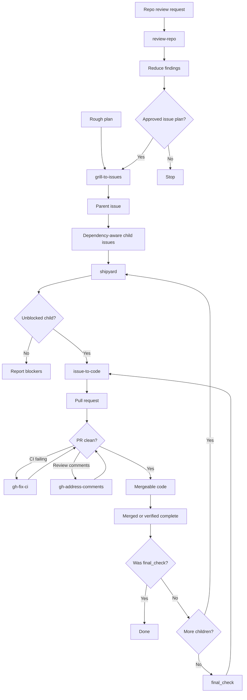
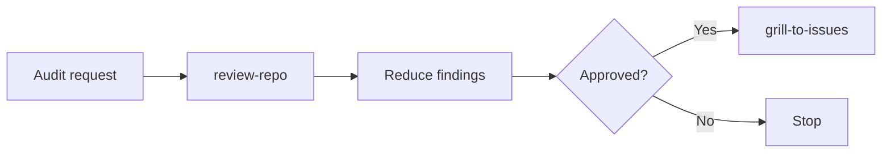
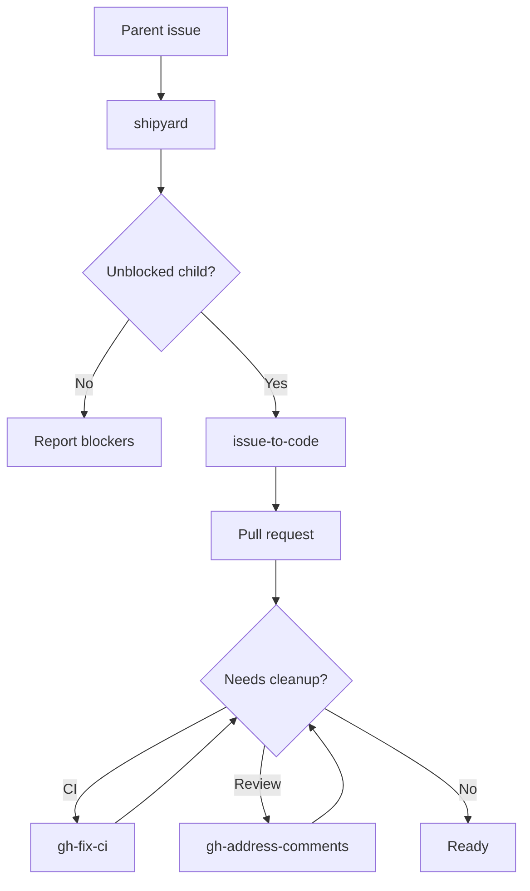
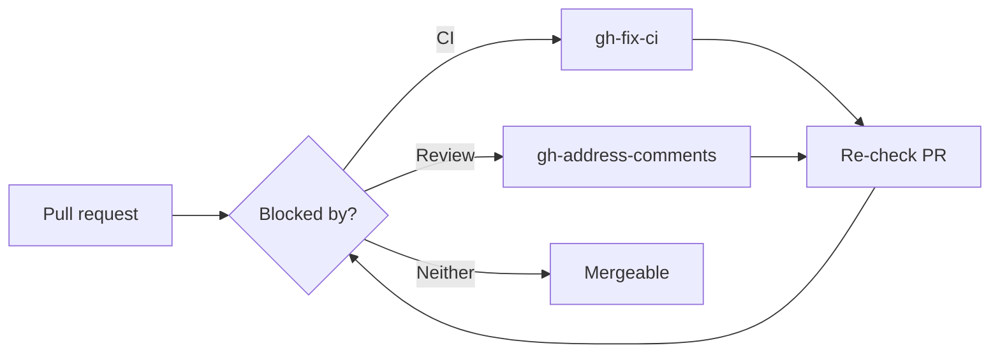

# Skills

Custom skills for real engineering workflows.

Codex is the default agent target, but these skills may be adapted for other agents that support comparable skill instructions. The skills are small, composable, and intentionally narrow: each one owns a specific part of the path from fuzzy work to reviewed, mergeable code.

## Workflow Map

## Workflows

### Audit to Issue Plan

Use this when the starting point is "audit this repo" and the output should become approved issue work.

- Run `review-repo`.
- Merge findings by touched area and verification boundary.
- Drop cleanup-only work or fold it into nearby valuable work.
- Use `grill-to-issues` only after the reduced issue list is approved.

### Plan to Issue Graph

Use this when the starting point is a rough plan that needs hard questioning before implementation.

- Run `grill-to-issues`.
- Produce the spec, dependency-aware child issues, parent issue, and one `final_check` child.

### Issue Graph to Pull Requests

Use this after a parent issue exists and implementation should proceed one child issue at a time.

- Run `shipyard`.
- Let it choose the next unblocked child and route implementation through `issue-to-code`.
- Do not stack PRs unless the parent issue explicitly requires it.
- Run `final_check` only after all other children are merged or verified complete.

### Pull Request to Mergeable

Use this when a PR already exists and needs to become mergeable.

- Use `gh-fix-ci` for failing GitHub Actions checks.
- Use `gh-address-comments` for unresolved review threads or requested changes.
- Re-check the PR after each cleanup pass.

## Skill Reference

This table is the canonical skill inventory: category, purpose, install command, and last implementation update.

| Category | Name | Purpose | Install | Last updated (UTC) |
|---|---|---|---|---|
| Planning | `review-repo` | Audit a repo for maintainability problems without editing code. | `npx skills install HenryQW/skills review-repo -a codex -y` | 2026-07-02 17:51 |
| Planning | `grill-to-issues` | Create dependency-aware child issues, one parent issue, and exactly one `final_check`. | `npx skills install HenryQW/skills grill-to-issues -a codex -y` | 2026-07-01 20:45 |
| Execution | `shipyard` | Advance a parent issue by running ready children through PRs. | `npx skills install HenryQW/skills shipyard -a codex -y` | 2026-07-03 13:49 |
| Execution | `issue-to-code` | Implement one GitHub issue on a clean branch and open a reviewed PR. | `npx skills install HenryQW/skills issue-to-code -a codex -y` | 2026-07-03 01:44 |
| Review gate | `greptile-loop` | Run Greptile on the current branch and fix actionable findings. | `npx skills install HenryQW/skills greptile-loop -a codex -y` | 2026-07-03 01:44 |
| PR publishing | `gh-pr-creation` | Publish the current branch as a GitHub or GitLab pull request. | `npx skills install HenryQW/skills gh-pr-creation -a codex -y` | 2026-07-02 16:45 |
| PR cleanup | `gh-fix-ci` | Diagnose and fix failing GitHub Actions PR checks. | `npx skills install HenryQW/skills gh-fix-ci -a codex -y` | 2026-07-03 10:25 |
| PR cleanup | `gh-address-comments` | Resolve actionable GitHub PR review feedback. | `npx skills install HenryQW/skills gh-address-comments -a codex -y` | 2026-07-03 10:25 |
| Support | `agent-memory` | Set up and distill project-scoped Agent memory. | `npx skills install HenryQW/skills agent-memory -a codex -y` | 2026-07-01 20:11 |
| Support | `agent-aeo` | Add or audit public website access patterns for AI agents. | `npx skills install HenryQW/skills agent-aeo -a codex -y` | 2026-05-10 12:32 |
