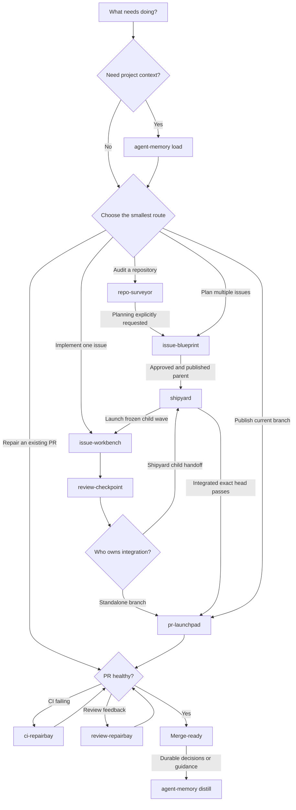

# 🛠️ Skills

Composable, agent-run workflows for taking repository work from first look to merge-ready pull request.

Use one skill for a focused job, or connect them as a guarded harness: each skill owns one stage, passes verified state forward, and stops when another skill should take over.

## 📦 Installation

```bash
npx skills add HenryQW/skills
```

## ⚙️ Requirements

- GitHub workflows require authenticated `gh`.
- `greptile` is optional; `review-checkpoint` falls back to local adversarial review when unavailable.

## 🧭 How the harness works

Choose the smallest entry point that matches the work. Skills can run alone; the arrows below show their explicit handoffs when they run together.

### Ⓜ️🅰️❎ Automation

1. `issue-blueprint` turns a rough idea, feature, or bug into an issue graph.
1. Approve or revise the plan.
1. `shipyard` handles the rest while you sip coffee.
1. Review and approve the PR.

### Granular Routing

- One actionable issue: `issue-workbench #<issue>`
- A repository audit: `repo-surveyor`; add issue planning only when you want a handoff to `issue-blueprint`
- A branch ready to publish: `pr-launchpad`
- A pull request blocked by checks or review: `ci-repairbay` or `review-repairbay`



When skills are nested, the outer workflow stays in charge. `shipyard` launches child work, ingests their handoffs, batches integration, and delegates PR repair without giving up ownership.

## 🤖 Meet the skills

### 🚀 Workflow skills

#### [🧯 `ci-repairbay`](ci-repairbay/)

Diagnoses failing GitHub Actions checks and applies the smallest scoped fix only when explicitly requested.

#### [🗺️ `issue-blueprint`](issue-blueprint/)

Builds a dependency-aware issue graph and publishes it only after approval of the exact plan.

#### [🔧 `issue-workbench`](issue-workbench/)

Implements one issue in its prepared branch, reuses HEAD-bound checks, then publishes a PR or returns a verified `shipyard` handoff.

#### [🚀 `pr-launchpad`](pr-launchpad/)

Publishes the inspected branch, reusing HEAD-bound validation and one matching PR when safe.

#### [🔭 `repo-surveyor`](repo-surveyor/)

Produces a read-only, evidence-backed maintainability report and optionally hands findings to `issue-blueprint`.

#### [🛡️ `review-checkpoint`](review-checkpoint/)

Reviews one pushed branch head through Greptile or one adversarial fallback and returns pass, pending, or blockers.

#### [🩹 `review-repairbay`](review-repairbay/)

Fixes selected review feedback with focused validation or clears actionable threads when explicitly authorized.

#### [🚢 `shipyard`](shipyard/)

Runs an approved issue graph through child-reviewed worktrees, frozen waves, one final parent review, and one repairable PR.

### 🧰 Supporting skills

#### [🌐 `agent-aeo`](agent-aeo/)

Adds or audits shared discovery, Markdown, and plain-text routes for public website content.

#### [🧠 `agent-memory`](agent-memory/)

Loads confirmed project context, captures complete decisions and reusable repository guidance, and writes approved notes directly to Obsidian; see the [setup guide](agent-memory/references/setup.md).

#### [✂️ `skill-optimizer`](skill-optimizer/)

Finds evidenced waste in an existing skill, applies the smallest root-cause fix, and verifies representative behavior.

## 📄 License

Apache License 2.0.
See [LICENSE](LICENSE).
