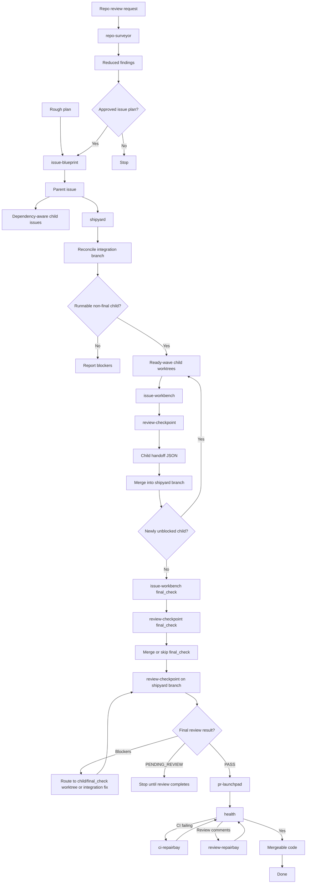
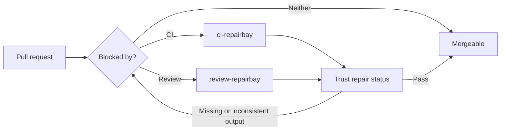

# Skills

<h1 align="center">
  🚢 Shipping ideas into production.
</h1>

A collection of skills for harness engineering and loop engineering: 🚢 shipping ideas into production.

These skills are small, composable workflow harnesses.
Each one owns one leg of the loop: survey the repo, blueprint the issues, build one issue, launch the PR, repair CI or review feedback, and let `shipyard` coordinate the route.

Supports Codex and other agents that use `npx skills` to manage skills.

## External Requirements

These workflows assume the external tools are already available:

- `gh` authenticated for the target GitHub repository.
- `$grill-with-docs` available before `issue-blueprint` runs.
- `greptile` is optional; `review-checkpoint` falls back to adversarial review when unavailable.

## 🧭 Workflow Map

## 🔁 Workflows

### 🔍 Audit to Issue Plan

Use this when the starting point is "audit this repo" and the output should become approved issue work.

- Run `repo-surveyor`.
- Merge findings by touched area and verification boundary.
- Drop cleanup-only work or fold it into nearby valuable work.
- Use `issue-blueprint` only after the reduced issue list is approved.

### 🧱 Plan to Issue Graph

Use this when the starting point is a rough plan that needs hard questioning before implementation.

- Run `issue-blueprint` with `$grill-with-docs` available.
- Produce the spec, dependency-aware child issues, parent issue, one `final_check` child, and the `shipyard` execution block.

### 🚢 Issue Graph to Pull Requests

Use this after a parent issue exists and implementation should proceed through the deterministic integration branch.

- Run `shipyard #<parent>`.
- Switch, create, or rename to the parent-derived integration branch before execution; stop only on dirty or unreconcilable branch state.
- Create worktrees only for the current runnable dependency wave, run each child through `issue-workbench` in integration mode, merge review-clean handoffs back into the shipyard branch, then re-inspect for newly unblocked children.
- Run `final_check` through `issue-workbench` only after all other children are merged or verified complete.
- Run `review-checkpoint` on the shipyard branch, route blocker findings back through the owning worktree or an integration fix, stop on `PENDING_REVIEW`, then use `pr-launchpad` only after the review gate passes.

### 🛠️ Pull Request to Mergeable

Use this when a PR already exists and needs to become mergeable.

- Use `ci-repairbay` for failing GitHub Actions checks.
- Use `review-repairbay` for unresolved review threads or requested changes.
- If the only non-green signal is a known unavailable external review check that the user or caller explicitly waived or replaced, record `Pending external unavailable check: <check>` instead of invoking repair skills.
- Trust the repair skill's reported status; re-check only when its output is missing or inconsistent.

## 📦 Skill Reference

This table is the canonical skill inventory: category, purpose, install command, and last implementation update.

| Category | Name | Purpose | Install | Last updated (UTC) |
|---|---|---|---|---|
| Planning | `repo-surveyor` | Audit a repo and return compact issue-ready maintainability findings. | `npx skills install HenryQW/skills repo-surveyor -a codex -y` | 2026-07-05 14:30 |
| Planning | `issue-blueprint` | Create dependency-aware child issues, one parent issue, and exactly one `final_check`. | `npx skills install HenryQW/skills issue-blueprint -a codex -y` | 2026-07-06 16:38 |
| Execution | `shipyard` | Orchestrate a parent issue through branch reconciliation, child worktrees, pending review gates, and one final PR. | `npx skills install HenryQW/skills shipyard -a codex -y` | 2026-07-06 16:38 |
| Execution | `issue-workbench` | Implement one issue with guarded diffs, deferred review gates, and JSON integration handoff. | `npx skills install HenryQW/skills issue-workbench -a codex -y` | 2026-07-06 16:38 |
| Review gate | `review-checkpoint` | Run blocker-only Greptile review, defer pending reviews, or fallback to adversarial review. | `npx skills install HenryQW/skills review-checkpoint -a codex -y` | 2026-07-06 16:38 |
| PR publishing | `pr-launchpad` | Publish the current branch as a GitHub or GitLab pull request. | `npx skills install HenryQW/skills pr-launchpad -a codex -y` | 2026-07-04 14:01 |
| PR cleanup | `ci-repairbay` | Diagnose and fix failing GitHub Actions PR checks. | `npx skills install HenryQW/skills ci-repairbay -a codex -y` | 2026-07-06 16:38 |
| PR cleanup | `review-repairbay` | Resolve actionable GitHub PR review feedback. | `npx skills install HenryQW/skills review-repairbay -a codex -y` | 2026-07-06 16:38 |
| Support | `agent-memory` | Set up and distill project-scoped Agent memory. | `npx skills install HenryQW/skills agent-memory -a codex -y` | 2026-07-04 06:23 |
| Support | `agent-aeo` | Add or audit public website access patterns for AI agents. | `npx skills install HenryQW/skills agent-aeo -a codex -y` | 2026-07-04 06:23 |
| Support | `skill-optimizer` | Optimize existing workflow skills by removing repeated decisions and tightening safety. | `npx skills install HenryQW/skills skill-optimizer -a codex -y` | 2026-07-06 22:20 |

## 📄 License

Apache License 2.0.
See [LICENSE](LICENSE).
